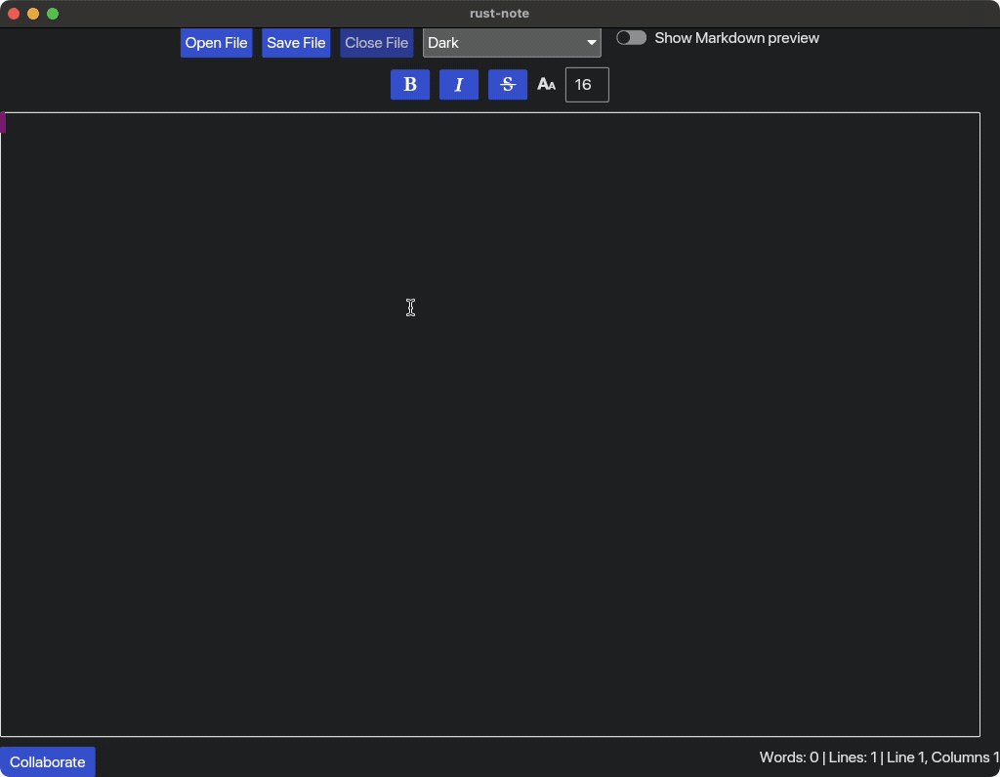

# ECE1724 Final Project Report: Rust-Based Markdown Editor with Collaboration Features

---

### Team Information
**Team Members:**
- **Jesse Na**
  - **Student Number:** 1005890788
  - **Preferred Email Address:** jesse.na@mail.utoronto.ca

- **Anubhav Sharma**
  - **Student Number:** 1004541659
  - **Preferred Email Address:** anubhav.sharma@mail.utoronto.ca

---

## Video Demo

A brief walkthrough of our project can be found [here](https://www.veed.io/view/0d28ec2d-a3ad-4e02-a7c0-9556597ed083?panel=share).

---

## Motivation
According to the [2024 Stack Overflow developer survey](https://survey.stackoverflow.co/2024/technology/#admired-and-desired), there is a clear preference among developers for relatively lightweight, low-overhead IDEs and text editors like VS Code, Vim, and Neovim.
This preference extends to portable file types such as Markdown, which boasts an admiration rate of 84.3%, making it the most admired asynchronous technology among developers.
Despite Markdown's popularity, tools like Confluence—a corporate, web-based wiki—continue to see higher usage, particularly among professional developers.
Confluence remains the second most used asynchronous technology after Jira, despite having an admiration rate over 30% lower than Markdown.
This discrepancy suggests a gap in the developer experience, especially for real-time collaboration, that traditional IDEs and editors are not addressing.

While popular tools such as Confluence and Notion have comparatively lower admiration rates (just above 50% and around 60%, respectively), they enjoy high usage due to their support for real-time collaboration.
As software engineers with experience working in professional settings with Confluence, Notion, Google Docs, and Microsoft Word, we believe that this gap exists because there are limited options for lightweight,
real-time collaborative editing directly within a developer’s terminal—an environment where many developers feel most productive.

A variety of documentation needs, such as code architecture, embedded hardware service and characteristic tables, and READMEs, are crucial to software development workflows.
Currently, documentation that requires real-time collaborative editing is often managed in tools like Confluence or Notion, while standalone files (especially Markdown) are kept in repositories and updated asynchronously via Git.
However, all forms of documentation could benefit from real-time collaboration, particularly within a terminal-based, low-overhead solution.

The motivation for our project, hence aims to implement a lightweight, terminal-based collaborative markdown editor.
While there are excellent standalone tools for editing markdown, very few integrate terminal-based editing with real-time collaboration.
Our aim was to combine markdown editing functionality, file management, and collaboration features to deliver a versatile tool for developers and writers.

The project was an exciting challenge to learn Rust and build a performant system, leveraging Rust's concurrency model and ecosystem libraries.
It was also fun to explore how collaborative systems can work using WebSockets, all while filling a niche in the Rust ecosystem.
A key motivation for this project was to leverage existing popular crates like `iced`, which provided the tools required to build a text editor.
This allowed us to focus on delivering a complex project within a short time frame while ensuring a feature-rich terminal-based collaborative editing tool.
By utilizing Rust’s robust concurrency features, we were able to build a performant system that could handle simultaneous user interactions and real-time updates efficiently.
The combination of WebSockets and Rust’s ecosystem ensured the application remained responsive, even under the demands of collaborative editing.

---

## Objectives
### Combined and Refocused Objectives

The goal of this project was to create a lightweight, low-latency, terminal-based collaborative text editor in Rust.
This tool was envisioned to enable multiple users to collaboratively edit and view text files in real time, while also incorporating key functionalities of popular text editors, such as basic text manipulation, theme selection, and live markdown preview.

Operating entirely within the terminal, this project sought to fill a gap in the Rust ecosystem by providing a standalone, CLI-based, Rust-native solution for collaborative editing.
It was designed not only as a simple editor but as a tool capable of supporting the following core objectives:

1. **Markdown Editing**: A standalone editor for markdown files with features for loading, saving, and basic text manipulation.
2. **Enhanced Usability Features**: IDE-like functionalities such as highlighting, theme selection, predefined hotkeys, and shortcut palettes to improve workflow efficiency and user experience.
3. **Live Markdown Preview**: A real-time markdown preview to facilitate formatted text visualization directly in the terminal, helping users see their content as it would appear when rendered.
4. **Collaboration**: Simultaneous multi-user editing with different levels of permissioning, such as read-only or full-edit access, ensuring secure and organized collaborative workflows.

The original implementation plan aimed to leverage advanced techniques like Conflict-free Replicated Data Types (CRDTs) for real-time, conflict-free collaborative editing.
However, during the actual implementation phase, we encountered significant challenges with integrating CRDTs into the `iced` framework, particularly when processing concurrent edits in its text-editor interface.
These limitations, which arose from the inherent constraints of the `iced` platform, made it difficult to fully implement seamless CRDT-based integration.

To address these issues and ensure real-time editing was still achievable, we adopted a pragmatic lock-based approach.
This mechanism enforces exclusive editing for individual lines, preventing users from making simultaneous edits to the same section of a document while allowing concurrent editing of other parts.
This compromise ensures document consistency and avoids merge conflicts, balancing the need for real-time collaboration with technical feasibility.

By leveraging Rust’s strengths in performance, safety, and concurrency, this project delivers a responsive and robust terminal application.
While the initial CRDT-based vision encountered obstacles, this experience provided valuable insights that are further discussed in the [Lessons Learned](#lessons-learned-and-concluding-remarks) section.
This project lays the groundwork for future enhancements, including syntax-aware editing and more sophisticated collaborative features, making it a powerful tool for technical users who prefer terminal environments over GUI or web-based solutions.

---

## Features

1. **Custom Client-Side Interface for Text Editing**
   - Implements a terminal-based text editor with basic text-editing operations such as creating, opening, editing, and saving files.
   - Provides button-based and hotkey-enabled text styling options, such as bold, italics, and underline.
   - Includes basic text-analysis tools, such as word and line counts.
   - Allows customization through different themes for an enhanced user experience.
   - Supports a markdown preview mode, similar to Obsidian, for `.md` files, enabling live preview of document edits.

2. **Networking and Collaboration Features**
   - Enables users to host a file and invite others to collaborate, with options for full or read-only access.
   - Implements lock-based editing to prevent concurrent modifications to the same line of text while allowing edits to other parts of the document.
   - Tracks and displays user cursors in real time, assigning distinct colors to each user.
   - Uses WebSockets for real-time synchronization between clients.
   - Ensures consistent document state across all participants without the complexity of real-time conflict resolution.

These features prioritize usability, simplicity, and performance, catering to users who prefer terminal environments and seek collaborative tools with essential text editing capabilities.
Future iterations of the tool may revisit CRDT-based editing to expand its functionality and flexibility.

---

## User's Guide

### Introduction
This is an interactive terminal-based application, not a crate. To build the executable and run the tool, follow the steps in the Reproducibility Guide to build and start the application.

---

### Markdown Editing
1. **Launch the Editor**: Run the executable to start the editor.
2. **Edit Text**: Use the interface to type, modify, or delete markdown content.
3. **Preview Mode**: Toggle between editing and preview modes to see the rendered markdown.
4. **Font Size Control**: Modify the font size of the preview section for better readability.
5. **Text analaysis**: The status bar at the bottom right corner provides real-time information about the current session, such as the number of words, lines and current cursor position.


---

### File Management
- **Open File**: Click the `Open File` button to load an existing markdown file for editing.
- **Save File**: Save your work using the `Save File` button during the session.
- **Close File**: Close the current file using the `Close File` button, to restore the editor to its initial state.
  - Note that this will not save any changes made to the file, and if you want to save your changes, you will need to do so by clicking the `Save File` button.


---

### Collaboration

1. **Start the Server**:
   - The WebSocket server is initiated from within the application by clicking the `Collaborate` button in the status bar, that triggers the collaboration modal.
   - There are two options in the collaboration modal:
     - **Start a Session**: To start a session, the user must provide a valid **read or write password**. Both fields cannot be left empty. Note that if the read password is supplied but the write password is not, edit access for the document will not be password restricted, and vice versa.
       - **File Path**: You can also optionally specify a valid **file path** that will be loaded into the editor at the start of the session and shared with all collaborators when the session starts.
     - **Join a Session**: To join an existing session, the user needs to specify whether they are joining as a **read-only** or **read/write** client. The password to join the session must be provided by the session host.
       - If the server is not running or cannot be reached, an error will be displayed.
       - If the provided password is incorrect, an error message will be shown indicating the issue.

2. **File Path and Permissions**:
   - For **starting a session**, the file path you provide will be loaded into the editor, and any changes will be broadcasted to all connected clients.
   - For **read/write permissions**, ensure that at least one password (either read or write) is set. Both fields cannot be left empty. Note that if the read password is supplied but the write password is not, edit access for the document will not be password restricted, and vice versa.

3. **Collaborator Access**:
   - Once the server is running, share the **relevant access-level password(s)** with your collaborators. They can use these to join the session as either read-only or read/write clients, depending on the permissions you set for them.
   - All changes made by any user will be reflected in real time for all connected users.


---

### Theme Management
1. **Theme Selection**: Customize the editor by choosing a theme from the dropdown menu in the toolbar.
2. **Dynamic Adjustment**: The selected theme immediately updates the editor and preview section for a personalized experience.



---

### Shortcut Palette
The application includes a shortcut palette to help users quickly access common features, which is togggered by pressing `Cmd + P`.

**Screenshot of the Shortcut Palette:**

*Insert screenshot here*

**Shortcut Table:**

| Action                    | Shortcut Key        |
|---------------------------|---------------------|
| **Bold**                    | `Cmd + b`                 |
| **Italic**                  | `Cmd + i`                 |
| **Strikethrough**           | `Cmd + f`                 |
| **Delete word**             | `Cmd + option + backspace`|
| **Delete line**             | `Cmd + backspace`         |
| **Toggle shortcut palette** | `Cmd + p`                 |
| **Toggle session modal**    | `Cmd + n`                 |
| **Open file**               | `Cmd + o`                 |
| **Save file**               | `Cmd + s`                 |


---

## Reproducibility Guide
### Prerequisites
- **Rust Toolchain:** Install via [rustup](https://rustup.rs/).
- **Build Environment:** Ubuntu or macOS systems.

### Steps to Set Up and Run
1. **Clone the Repository:**
   ```bash
   git clone https://github.com/anubhavsharma515/rust-collaborative-text-editor.git
   cd rust-collaborative-text-editor
   ```

2. **CD into the Project Directory:**
   ```bash
   cd rust-note
   ```

3. **Build the Project:**
   ```bash
   cargo build --release
   ```

4. **Start the Markdown Editor**
   ```bash
   ./target/release/rust-note
   ```
---

## Contributions by Each Team Member

### Phase 1: Build Interface for Text Editing
**Objective:** Establish a responsive and functional `.md` file editor interface within the terminal.

**Responsibilities:**

- **Anubhav**:
    - Implemented a **Menu Bar** with options for file picking, theme selection, file saving, and Markdown preview.
    - Developed a custom **User Cursor Position Marker** to track and display the user’s cursor location within the editor.
    - Created a **Status Bar** that supports text-analysis features like word, and line count.

- **Jesse**:
    - Developed a **Formatting Bar** with basic stylistic controls such as **bold, italic, underline** for text, along with **font size adjustments**.
    - Set up key-binding shortcuts for common text editing (e.g., **cut, copy, paste, select, delete, and save**) as well as the text-formatting actions (mentioned above).
    - Implemented a custom **Shortcut Palette** widget for displaying supported key-bindings.

**Key Outcome:** This phase resulted in a standalone text editor with essential widgets for file handling and style adjustments, serving as the foundation for real-time collaborative features in later phases.

---

### Phase 2: Add Server-Side Collaborative Editing Capabilities
**Objective:** Enable server functionality for hosting collaborative editing sessions, with secure connection options.

**Responsibilities:**

- **Jesse**:
    - Implemented a **Server Layer** to start a local server and **Password Protection** to securely hash passwords (using argon2id) for session access.
    - Developed a **Status Endpoint** (`/status`) so users can check the availability of the server.
    - Added **Access Levels** by implementing read-only and full-edit URLs to control user permissions for each session.

- **Anubhav**:
    - Developed a custom **Collaboration Modal** to allow users to specify a file path and password for starting a new session or joining an existing one.
    - Configured **Program Argument Validation** to allow users to specify a valid local file path for staring an existing session or a password for joining a session.

**Key Outcome:** This phase introduced basic server functionality, allowing a user to host a file for collaborative editing with optional password protection. Role-based access (read-only and full-edit) was implemented, enhancing security and usability for real-time collaboration.

---

### Phase 3: Implement Real-Time Collaboration with Websockets
**Objective:** Establish real-time collaborative editing by enabling multiple users to connect and see each other’s edits and cursor positions instantly.

**Responsibilities:**

- **Jesse**:
    - Implemented **WebSocket Channels** in the server, where each connected client operates on a separate thread.
    - Designed data structure to receive, send and display all active user cursor positions and document updates to host and other connected clients.
    - Broadcasted the host’s file state and cursor positions to all connected clients in real-time.

- **Anubhav**:
    - Designed **Client-Side Behavior** to receive and display all active user cursor positions and document updates.
    - Enabled clients to **Send Edits** of the host file state, including cursor positions, back to the server, which were then broadcasted to other connected users.

**Key Outcome:** This phase enabled low-latency, real-time collaboration, allowing users to edit together and see each other’s cursor positions.
The foundational framework for real-time document state synchronization was completed, though conflict resolution was not yet addressed [see #Lessons Learned and Concluding Remarks](#lessons-learned-and-concluding-remarks).

---

## Lessons Learned and Concluding Remarks

### <a name="lessons-learned-and-concluding-remarks"></a>Lessons Learned
-	Leveraging community crates (e.g., iced, serde, async-tungstenite) accelerated development significantly. However, in the case of iced, it
also came at the cost of performance. iced provided us with a text editor widget that enabled the creation of a rich text editing interface,
but this widget was too high-level and abstract. In other words, it did not expose enough of the underlying text editing functionality to allow
us to manually make edits efficiently. For example, suppose we wanted to insert a single character at row r and column c, we would have to move
the text editor cursor r rows down and c columns right—each move costing a function call—and then insert the character. Moreover, the text editor
and its contents were not serializable, meaning we had to create our own "Document" struct alongside the iced text editor to keep track of the
text content and had to figure out how to synchronize the two which involved translating iced actions—which could be quite unintuitive at times—
to document insert and delete operations.

-	Building a complex project with a lot of dependencies like a real-time collaborative systems is challenging. In our case, it was particularly
around state synchronization and conflict resolution where we had the most challenges. Cargo made it easy to plug in dependencies and manage them,
but nonetheless we did not foresee that certain crates might not work well with each other like iced and cola-crdt. We had initially wanted to
use cola for conflict resolution, but as mentioned above, we had to translate iced actions to document operations. In the case of cola, that meant
we had to translate iced actions to cola operations, which led us to weird and unresolvable bugs that forced us to abandon cola.

-	Rust is a fantastic language. Despite the challenges we ran into, we don't think any of them were due to Rust nor were any of them made worse
by its strong type system and its concurrency model. On the contrary, it greatly enhanced code safety and performance, and we only wish that the
crates we used leveraged the compiler more to catch bugs at compile time instead of at runtime which is where we had the most headaches. For
example, we've already mentioned our issues with iced and cola. The issues and bugs we ran into that made us go in circle for hours were almost
always at runtime instead of compile time and its largely because cola does not return Results to handle errors and instead panics. At least,
at compile time, we would know what the issue is and where it is, so that the time we spent debugging would not feel wasted or directionless.


### Concluding Remarks

This project was fun, rewarding and educational, providing valuable insights into Rust’s capabilities and its budding ecosystem.
Its given us exposure to many of Rust's crates and has given us an idea of which one's we would like to work with in the future.
Finally, by filling a gap in terminal-based collaborative tools, we hope this project serves as a foundation for others in the community to expand upon.
